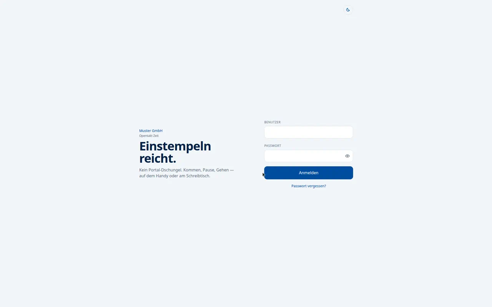
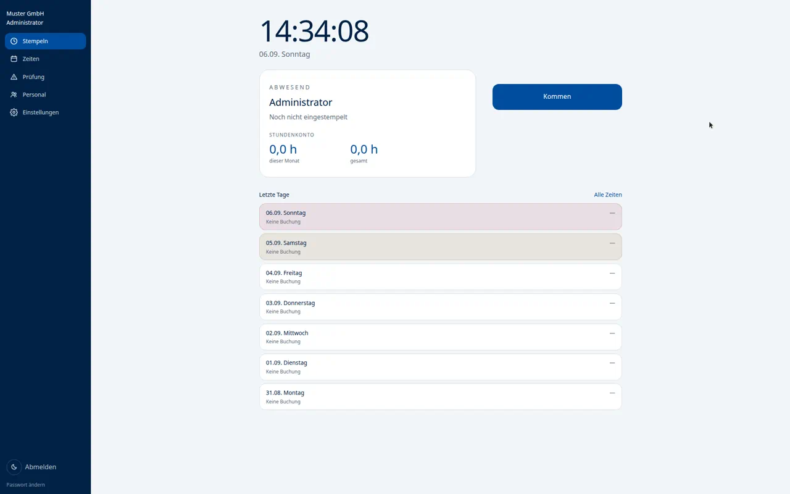

# Opentakt Zeit

On-Prem-Zeiterfassung von **Opentakt**: **Kommen, Pause, Gehen** — als PWA auf dem Handy, am Schreibtisch und am Terminal.

Kein SaaS, keine Cloud-Pflicht. Python-Backend, SQLite, React-PWA, nginx.

Opentakt Zeit ist das erste Produkt unter dem Namen Opentakt. Weitere Anwendungen (zum Beispiel Vereinsverwaltung) sollen folgen.

[](LICENSE)
[](https://github.com/christiankohrn/opentakt-zeit/actions/workflows/ci.yml)





## Funktionen

- Stempeln in der PWA (Kommen, Pause, Gehen), inkl. Offline-Warteschlange
- Eigenes Zeiten-Konto mit Monats- und Gesamtsaldo (Gleitzeit)
- Personal: Stammdaten, Arbeitsmodelle ab Datum, Ein-/Austritt
- Plausibilität (fehlendes Gehen, Pausen, 10-Stunden-Grenze, …)
- Abwesenheiten, Feiertage je Bundesland, betriebsfreie Tage
- Datafox MasterIV über HTTP (Transponder), optional Polling per DFCom, optional ohne Web-Login
- Optionales ESP32-Terminal (eigene JSON-API, OLED-Displaytexte in den Einstellungen)
- Optional LDAP und SMTP (Feierabend-Erinnerung)
- CSV-Export, tägliche SQLite-Backups, Dark Mode

## Schnellstart (Entwicklung)

Voraussetzungen: Python 3.12+, Node 20+.

```bash
git clone https://github.com/christiankohrn/opentakt-zeit.git
cd opentakt-zeit
cp config.toml.example config.toml   # Passwörter anpassen

python3 -m venv backend/.venv
source backend/.venv/bin/activate    # Windows: backend\.venv\Scripts\activate
pip install -r backend/requirements.txt

cd frontend && npm install && cd ..
```

Zwei Terminals:

```bash
# Backend, Port 8000
cd backend
PYTHONPATH=. uvicorn app.main:app --reload --host 127.0.0.1 --port 8000
```

```bash
# Frontend mit Proxy auf /api
cd frontend
npm run dev
```

Im Browser: [http://127.0.0.1:5173](http://127.0.0.1:5173)

Seed-Logins stehen in `config.toml` unter `[seed]` (Standardbenutzer `admin`, `personal`, `mitarbeiter`). Nur auf einer **leeren** Datenbank werden sie angelegt.

Optional Demo-Tage für Max Mustermann:

```bash
cd backend && PYTHONPATH=. python -m app.demo_data
```

## Produktion (Debian)

Eine öffentliche Domain, Debian 12/13, SSH als root:

```bash
git clone https://github.com/christiankohrn/opentakt-zeit.git /tmp/opentakt-zeit
export DOMAIN=zeit.firma.de EMAIL=it@firma.de ORG_NAME="Muster GmbH"
bash /tmp/opentakt-zeit/deploy/new-host.sh
```

Danach liegen App, Config und Daten unter `/opt/zeiterfassung`, `/etc/zeiterfassung/` und `/var/lib/zeiterfassung/`. Die Pfade und systemd-Dienste heißen intern weiter `zeiterfassung`, damit bestehende Installationen ohne Migration laufen. Erst-Passwörter stehen einmalig in `/etc/zeiterfassung/seed-once.txt` — **nicht** ins Git.

Ausführlich: [DEPLOY.md](DEPLOY.md). Terminals: [docs/datafox-masteriv.md](docs/datafox-masteriv.md).

## Tests

```bash
cd backend && PYTHONPATH=. python -m pytest
cd frontend && npx tsc --noEmit
```

## Konfiguration

`config.toml` (lokal im Repo-Root oder `ZEITERFASSUNG_CONFIG=/pfad/config.toml`). Vorlage: [`config.toml.example`](config.toml.example).

| Schlüssel | Bedeutung |
| --- | --- |
| `org_name` | Name in der Oberfläche und in Mails |
| `timezone` | z. B. `Europe/Berlin` |
| `bundesland` | Feiertage (z. B. `NW`, `BY`) |
| `secret_key` | Session-Cookie, unbedingt ändern |
| `datafox_secret` | Shared Secret für Terminal-HTTP; leer = API aus |
| `esp_terminal_secret` | Shared Secret für das ESP32-Terminal (`X-Terminal-Key`); leer = API aus |
| `dfcom_lib` | Optionaler Pfad zu `libDFCom.so` (sonst `/opt/zeiterfassung/lib/libDFCom.so`) |

`config.toml`, `*.db` und `.env` sind per `.gitignore` ausgeschlossen. ESP32-Gerät: [docs/esp32-terminal.md](docs/esp32-terminal.md).

## Mitwirken

Fehler, Ideen und Pull Requests sind willkommen. Bitte [CONTRIBUTING.md](CONTRIBUTING.md) und den [Verhaltenskodex](CODE_OF_CONDUCT.md) lesen. Sicherheitslücken **nicht** öffentlich tracken — siehe [SECURITY.md](SECURITY.md).

## Lizenz

[GNU Affero General Public License v3.0 oder später](LICENSE) (`AGPL-3.0-or-later`).

Copyright © 2026 Christian Kohrn.

Die AGPL passt zu einer App, die als Netz-Dienst läuft: selbst hosten, anpassen und kommerziell betreiben ist erlaubt. Wer eine veränderte Version **als Dienst für andere** anbietet, muss den zugehörigen Quellcode ebenfalls unter AGPL bereitstellen. Das verhindert geschlossene SaaS-Forks, ohne Selbst-Hosting einzuschränken.

Abhängigkeiten (FastAPI, React, …) behalten ihre eigenen Lizenzen. Die optionale Datafox-Kommunikationsbibliothek DFCom ist Software der Datafox GmbH, nicht Teil von Opentakt Zeit; siehe [docs/datafox-masteriv.md](docs/datafox-masteriv.md) und `deploy/install-dfcom.sh`.
